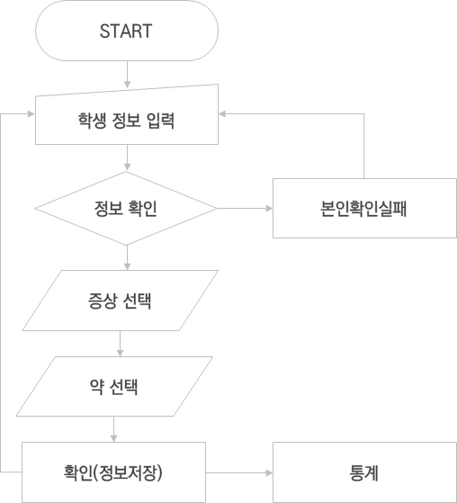
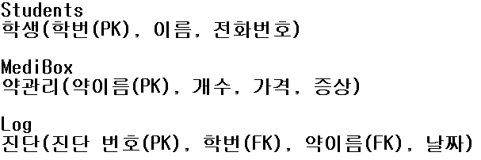
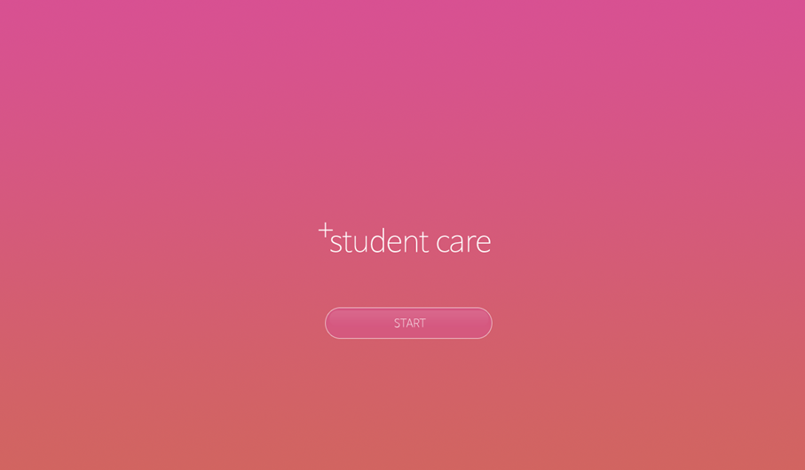
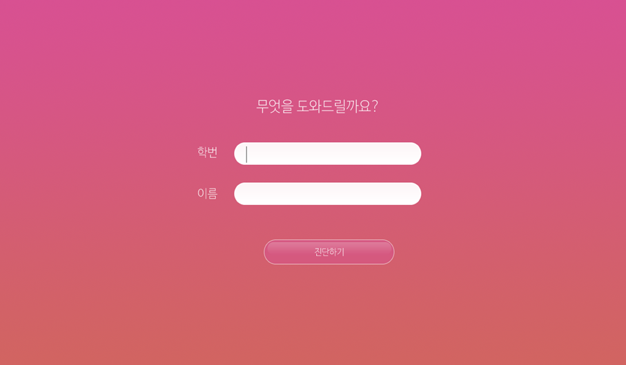
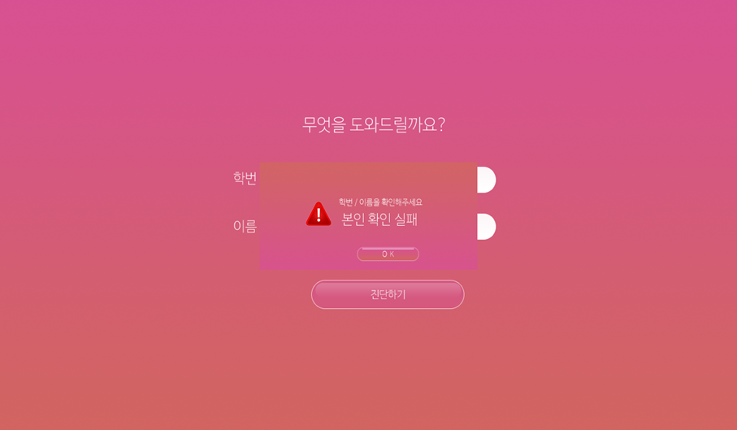
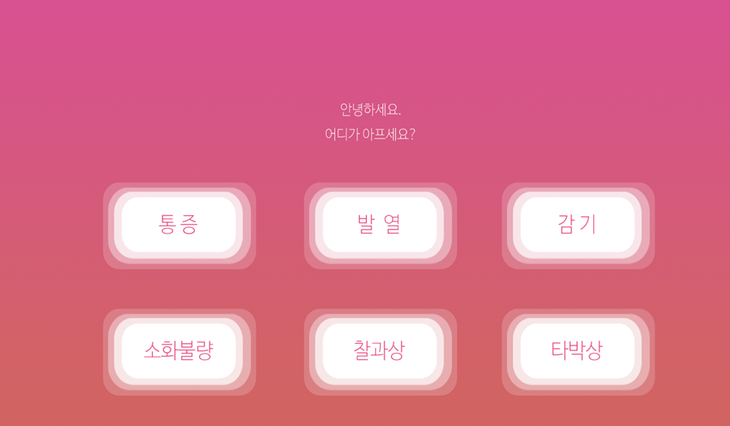
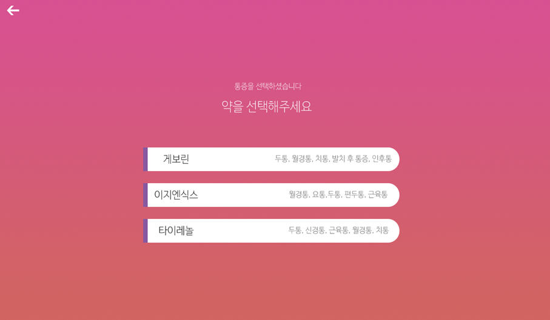
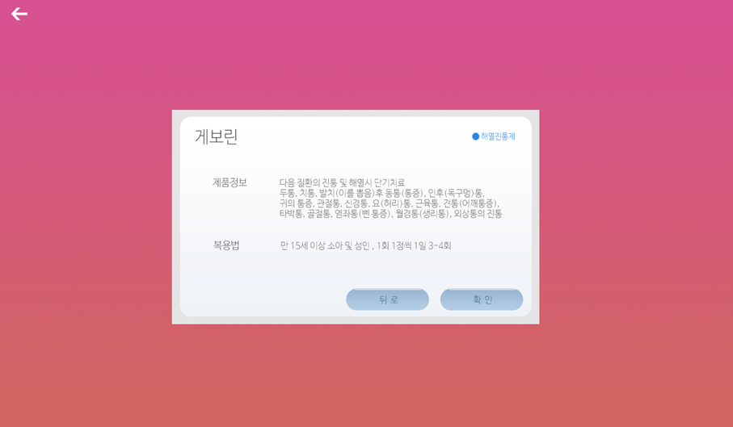
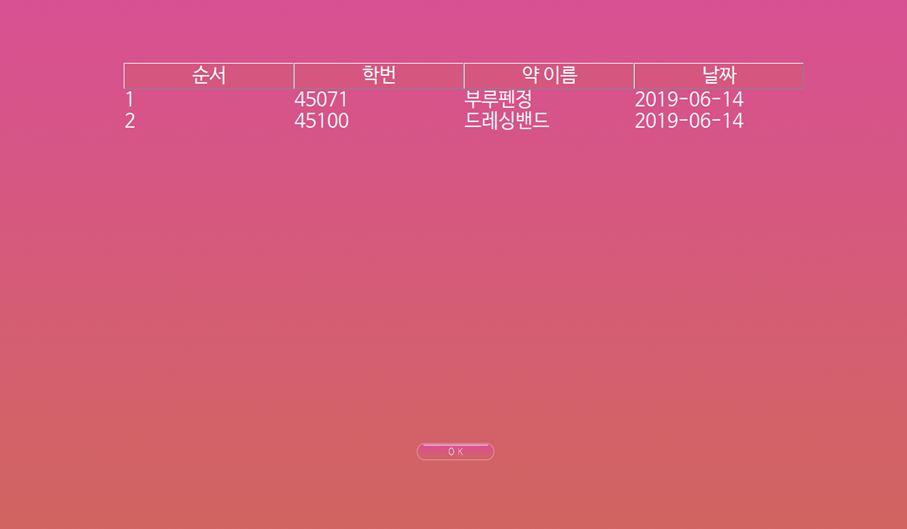

2019 1학기 JAVA_Project
=====
### 소프트웨어 정보  
`jdk 10` `Oracle Database 11g Express Edition`

### 프로젝트 수행 목적  
  * #### 프로젝트 정의
> 기존의 수동적인 시스템 개선  
> 불필요한 자원 낭비와 교사, 학생의 불편 해소

  * #### 프로젝트 배경
 > 학교 보건실을 방문하는 학생 수가 10년 새 2배 가까이 증가한 것으로 나타났습니다.
보건실에는 아픈 학생들이 진료를 받기 위해 방문을 하면 책상 위에 있는 종이에 자신의 학번과 아픈 곳을 상세하게 적는 부분이 있는데 매번 반복하는 일이 고충입니다. 또한 그렇게 진료 기록을 통계를 내야할 때 종이로 되어 분실이 되는데 이런 것으로 인해 통계에 정보누락과 같은 경우가 생깁니다.
또한 보건 선생님이 안계신 점심시간이나 퇴근 후에는 다쳐도 진료를 받을 수 없습니다.
 
  * #### 프로젝트 목표
 > 진료 자동화 프로그램을 통해 진단 기록을 쉽게 남기고 보건 선생님이 없더라도 쉽게 약을 받아갈 수 있는 프로그램을 만드는 것이 목표입니다.

### 프로젝트 구조  

* superclass // 프레임
  * MainFrame // 최상위 프레임 Layout
  * ImagePanel // 배경이미지 Layout
  * Button // 버튼 Layout
  * MediBox_List // 약 품목 Layout
  * DAO // DB 처리 관련
  * DatabaseConstant // DB 입력 정보
  * Log_Table // log getter, setter, constructer
  * Student_Table // students getter, setter, constructer
* StudentCare // 메인 화면
* Info(r)mation // 로그인 창 
  * CheckFail // 실패 화면
* Symptom // 증상 선택 화면
* MediBox // 약 선택 화면
* Medicine_Info // 약 정보 Layout

### DB 구조

### 실행화면

### 제언
> * 진단 기록을 시작화면에서 열 수 있도록 편집
> * 약의 개수를 파악하고, 개수가 떨어지면 Orders 테이블에 주문 목록 추가
> * 테이블들을 자동으로 엑셀 파일로 만들어주기
