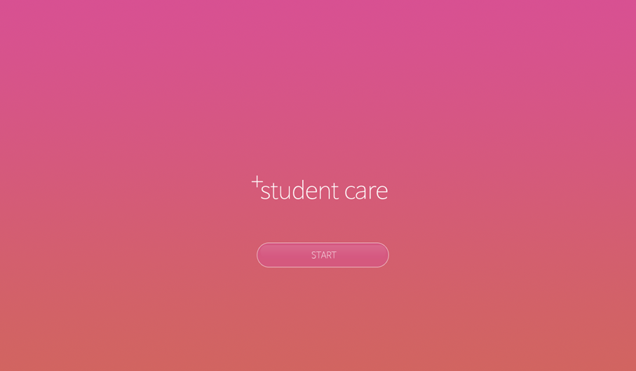
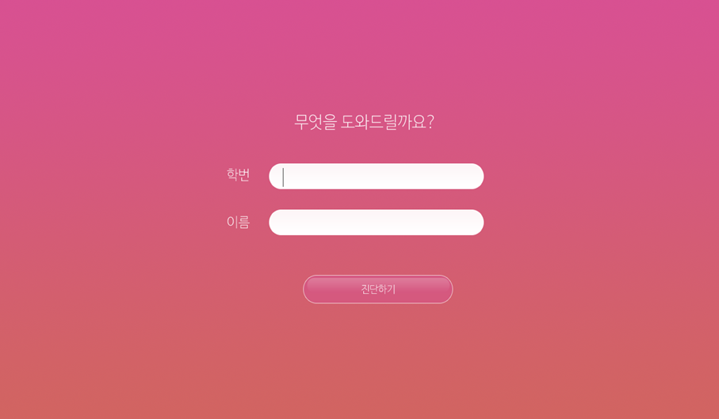
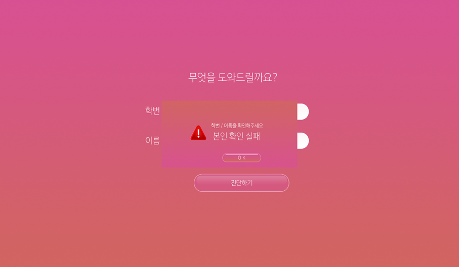
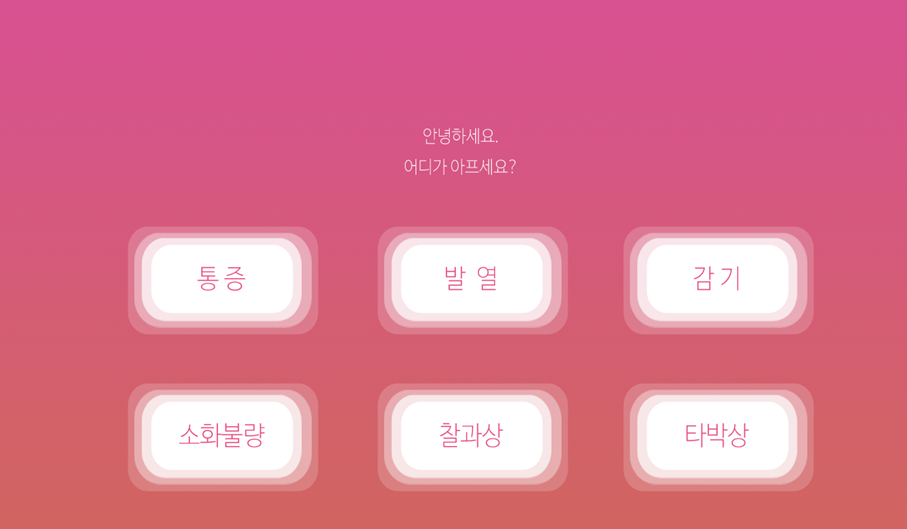
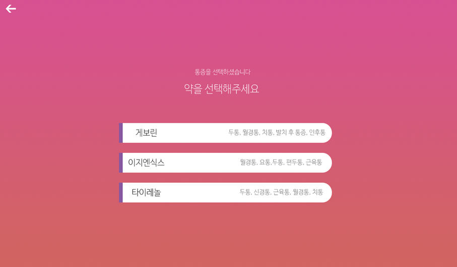
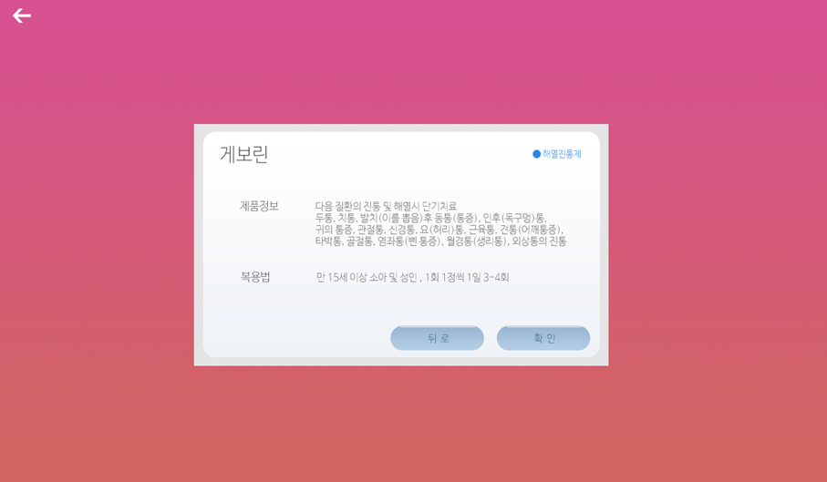
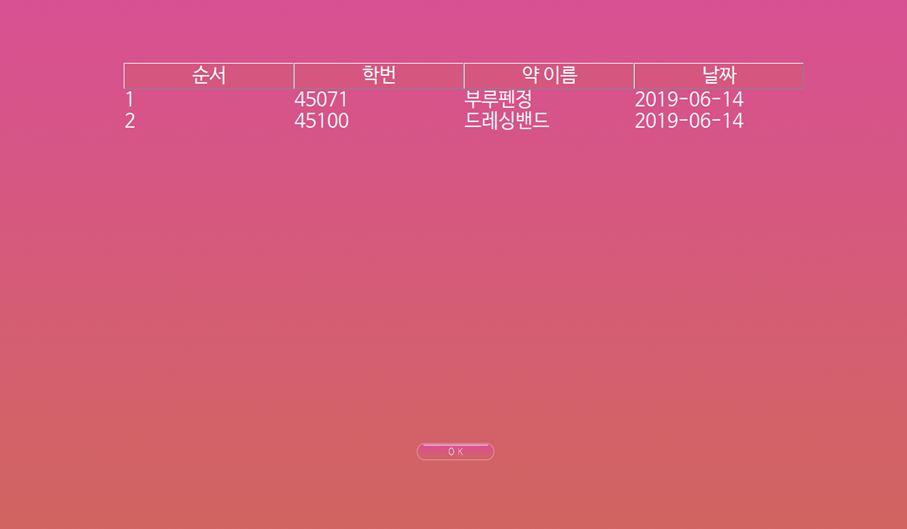

2019 1학기 JAVA_Project
=====
### 소프트웨어 정보  

`eclipse photon(June 2018)`
`jdk 10`

### 프로젝트 구성  

* superclass // 프레임
  * MainFrame // 최상위 프레임 Layout
  * ImagePanel // 배경이미지 Layout
  * Button // 버튼 Layout
  * MediBox_List // 약 품목 Layout
  * DAO // DB 처리 관련
  * DatabaseConstant // DB 입력 정보
  * Log_Table // log getter, setter, constructer
  * Student_Table // students getter, setter, constructer
* StudentCare // 메인 화면
* Info(r)mation // 로그인 창 
  * CheckFail // 실패 화면
* Symptom // 증상 선택 화면
* MediBox // 약 선택 화면
* Medicine_Info // 약 정보 Layout

### 실행화면

